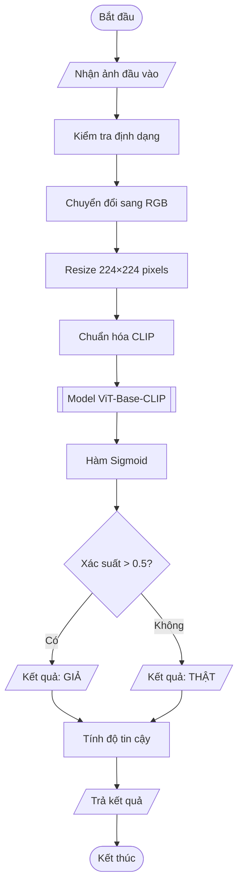
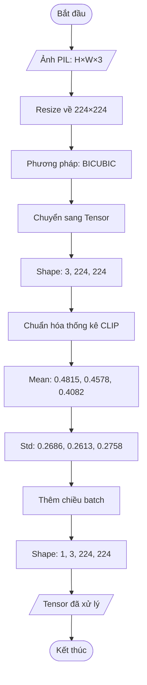
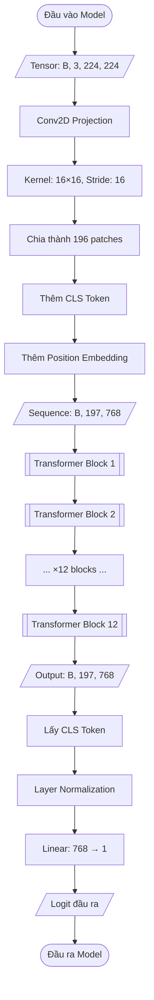
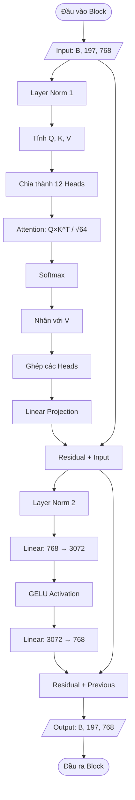
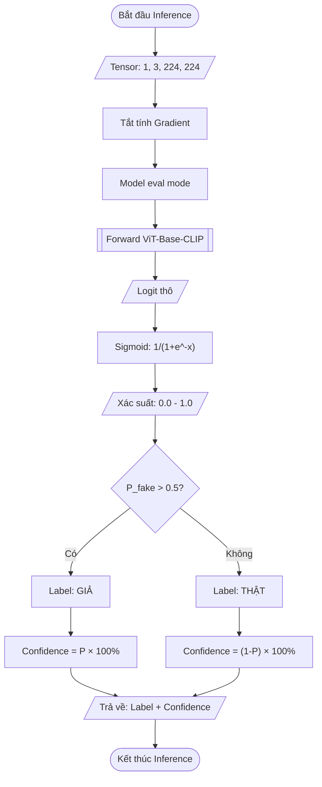
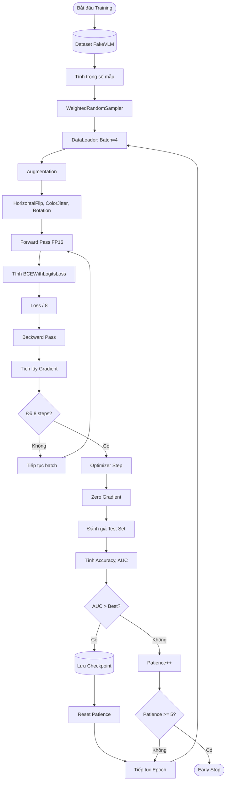
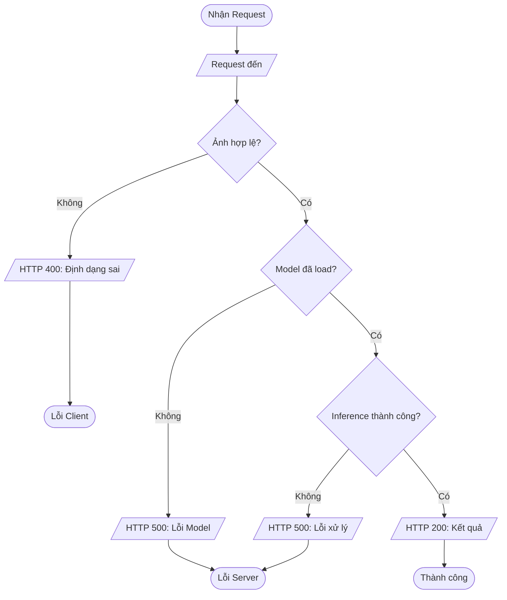
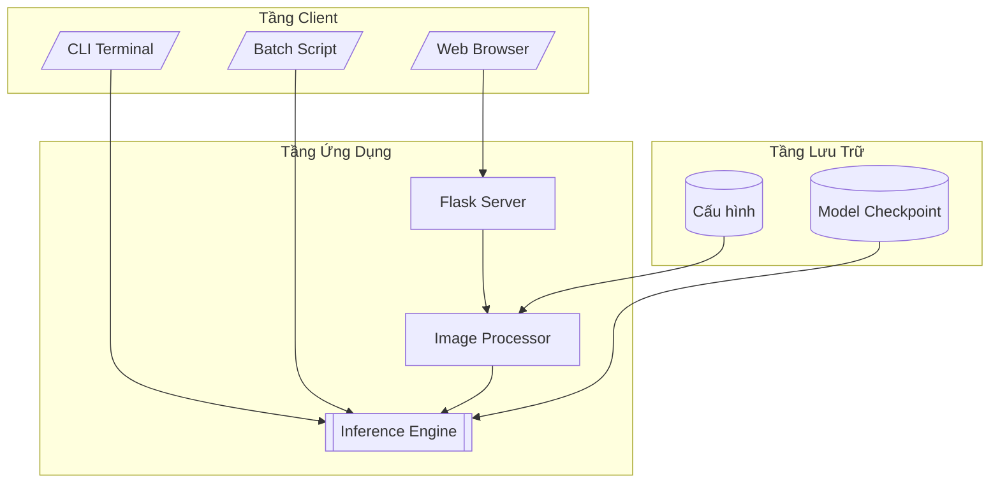

# Flowchart - Hệ Thống Phát Hiện Ảnh Giả

## 1. Tổng Quan Hệ Thống

---

## 2. Module Tiền Xử Lý Ảnh

---

## 3. Kiến Trúc Vision Transformer

---

## 4. Chi Tiết Transformer Block

---

## 5. Quy Trình Suy Luận

---

## 6. Quy Trình Training

---

## 7. Xử Lý Lỗi API

---

## 8. Kiến Trúc Triển Khai

